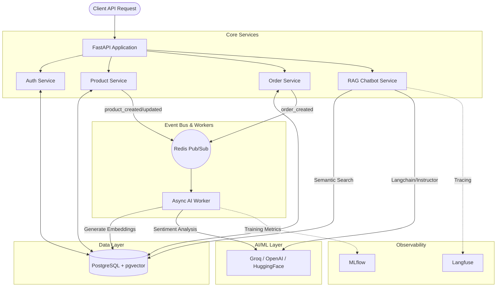

# Event-Driven AI E-Commerce Backend

[](https://fastapi.tiangolo.com/)
[](https://www.postgresql.org/)
[](https://redis.io/)
[](https://huggingface.co/)
[](https://mlflow.org/)

A production-grade, event-driven e-commerce backend demonstrating a full Generative AI lifecycle. It features a Retrieval-Augmented Generation (RAG) chatbot, hybrid semantic recommendations, asynchronous embedding generation, and a fine-tuned LoRA adapter tracked via MLflow.

---

## 🏗 System Architecture

The system is built on an event-driven microservices-like architecture using Redis pub/sub to decouple heavy AI workloads (like embedding generation) from fast API responses.



---

## ✨ Key AI Features

### 1. Semantic Product Search (pgvector)
Products are automatically embedded into 384-dimensional vectors upon creation via an asynchronous Redis worker. Queries are converted to vectors and compared using cosine distance in PostgreSQL (`pgvector`), providing meaning-based search instead of just keyword matching.

### 2. Conversational RAG Chatbot
A customer support chatbot endpoint (`/api/v1/products/chat`) that:
- Uses semantic search to retrieve the most relevant catalog items.
- Injects context into structured LLM prompts using the `instructor` library.
- Safely falls back across Groq, OpenAI, and Hugging Face inference APIs.
- Emits fully traced execution spans to **Langfuse** for observability.

### 3. Personalized Hybrid Recommendations
Computes a dynamic "taste vector" for each user based on their interaction history (views, cart adds, purchases, positive reviews). The system applies a time-decay algorithm so recent interactions carry more weight, and queries `pgvector` to find semantically similar products the user hasn't interacted with yet.

### 4. Custom Fine-Tuned LoRA Adapter
Includes a complete fine-tuning pipeline (`fine_tune.py`) that uses QLoRA 4-bit quantization to train a Llama-3 8B model to parse unstructured product descriptions into structured JSON attributes. The training run, learning rates, and weights are tracked locally using **MLflow**. The API supports loading the fine-tuned adapter directly from the Hugging Face hub for inference.

---

## 🚀 Getting Started

### Prerequisites
- Docker & Docker Compose
- Python 3.10+

### 1. Clone & Environment Setup
```bash
git clone https://github.com/yourusername/diq-ebackend.git
cd diq-ebackend

# Create virtual environment
python -m venv .venv
source .venv/bin/activate

# Install dependencies
pip install -r requirements.txt

# Setup environment variables
cp .env.example .env
```
*Edit `.env` to add your `GROQ_API_KEY` or `OPENAI_API_KEY` for the chatbot.*

### 2. Start Infrastructure
Launch PostgreSQL (with pgvector) and Redis using Docker Compose:
```bash
docker-compose up -d
```

### 3. Run the Application
Start the FastAPI server:
```bash
uvicorn app.main:app --reload --port 8000
```
In a separate terminal, start the asynchronous AI worker:
```bash
python worker.py
```

### 4. View API Documentation
Navigate to [http://localhost:8000/docs](http://localhost:8000/docs) to access the interactive Swagger UI.

---

## 🧪 Example API Usage

### Create a Product (Triggers Async Embedding)
```bash
curl -X POST "http://localhost:8000/api/v1/products/create-product" \
     -H "Content-Type: application/json" \
     -H "Authorization: Bearer <YOUR_JWT_TOKEN>" \
     -d '{
           "name": "Ultralight Camping Tent",
           "description": "A 2-person waterproof tent weighing only 3 lbs. Perfect for backpacking.",
           "price": 199.99,
           "stock": 15
         }'
```
*Note: The API responds immediately. In the background, the Redis worker computes the text embedding and saves it to PostgreSQL.*

### Chat with the Catalog (RAG)
```bash
curl -X POST "http://localhost:8000/api/v1/products/chat" \
     -H "Content-Type: application/json" \
     -d '{
           "query": "I need something lightweight for hiking in the rain",
           "limit": 3
         }'
```

### Parse Unstructured Description (Fine-Tuned LLM)
```bash
curl -X POST "http://localhost:8000/api/v1/products/parse-description" \
     -H "Content-Type: application/json" \
     -H "Authorization: Bearer <YOUR_JWT_TOKEN>" \
     -d '{
           "description": "Looking for a green mechanical keyboard with brown switches for $85. We have 12 left."
         }'
```

---

## 📈 MLflow & Training
To view the experiment tracking dashboard for the LoRA fine-tuning pipeline:
```bash
mlflow ui --backend-store-uri sqlite:///mlflow.db
```
Navigate to `http://localhost:5000` to see training loss, learning rates, and saved model artifacts.

## 🛡 Testing
The project includes a robust suite of integration tests that automatically spin up a dedicated `ecommerce_test` database.
```bash
pytest
```
