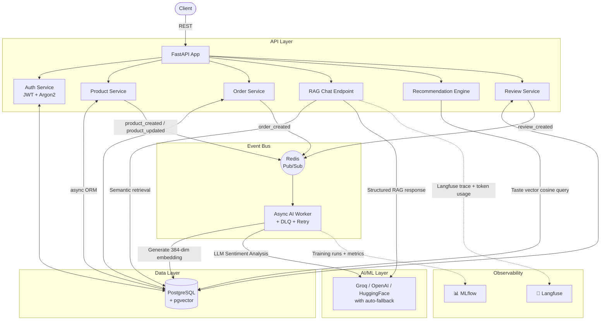

# Event-Driven AI E-Commerce Backend

[](https://fastapi.tiangolo.com/)
[](https://www.postgresql.org/)
[](https://redis.io/)
[](https://huggingface.co/)
[](https://mlflow.org/)
[](https://langfuse.com/)
[](LICENSE)

> A **production-grade, event-driven backend** that demonstrates a complete **Generative AI lifecycle** — from training data curation and QLoRA fine-tuning tracked in MLflow, to real-time async inference, RAG-powered chat, and LLM observability via Langfuse. Built with FastAPI, PostgreSQL+pgvector, and Redis pub/sub.

---

## 🎯 Why This Project?

Most GenAI demos stop at "call an API and display the output." This project goes further — it shows **how AI models are integrated at the infrastructure level** inside a realistic, scalable backend system:

| Dimension | What's demonstrated |
|---|---|
| **Model Training** | QLoRA 4-bit fine-tuning of Llama-3 8B with PEFT + MLflow experiment tracking |
| **Structured Inference** | Constrained LLM output with `instructor` library (Pydantic-validated JSON) |
| **Semantic Search** | 384-dim text embeddings stored in pgvector, queried via cosine distance |
| **Personalization** | Time-decayed, interaction-weighted taste vectors driving hybrid recommendations |
| **LLM Observability** | End-to-end Langfuse tracing with token counts and model metadata |
| **Resilient Workers** | Async Redis pub/sub worker with exponential backoff retries and a dead-letter queue |

---

## 🏗️ System Architecture

The system decouples AI workloads from API response paths using a **Redis pub/sub event bus**. This ensures that heavy inference tasks (embedding generation, sentiment analysis) never block the user-facing API.



### Key Design Decisions

- **Async-first**: Built entirely with `asyncio`, `asyncpg`, and `aioredis` — no blocking I/O.
- **Event-driven decoupling**: API publishes domain events; the worker subscribes and handles AI side-effects independently. This pattern scales naturally to separate worker fleets.
- **Multi-provider LLM fallback**: Every LLM call cascades through Groq → OpenAI → HuggingFace Inference API → deterministic fallback. Zero single points of failure.
- **Structured outputs only**: The `instructor` library wraps every LLM call to enforce Pydantic schema validation on responses — no free-form JSON parsing.

---

## ✨ Core GenAI Features

### 1. 🔍 Semantic Product Search (pgvector)

When a product is created or updated, an event is published to Redis. The async worker picks it up, generates a **384-dimensional sentence embedding** via `sentence-transformers` (`all-MiniLM-L6-v2`), and writes it back to the `products` table in PostgreSQL (pgvector column).

Customer queries are embedded at runtime and compared using **cosine distance** in a single SQL query — no separate vector DB needed.

```sql
-- Simplified pgvector cosine search
SELECT * FROM products
ORDER BY embedding <=> query_vector
LIMIT 5;
```

### 2. 💬 RAG-Powered Customer Support Chatbot

The `/api/v1/products/chat` endpoint implements a full **Retrieval-Augmented Generation** pipeline:

1. **Retrieve**: Embed the user's query → cosine search against the product catalog.
2. **Augment**: Inject top-K products as context into a strict system prompt (hallucination guardrails included).
3. **Generate**: Call Groq/OpenAI via `instructor` to produce a structured `ChatBotResponse` Pydantic object containing `response`, `recommended_product_ids`, and `follow_up_questions`.
4. **Trace**: Every LLM generation span is emitted to **Langfuse** with model name, prompt tokens, and completion tokens via the `@observe` decorator.

### 3. 🧠 Time-Decayed Personalized Recommendations

The recommendation engine computes a per-user **taste vector** from their interaction history (views, cart adds, purchases, positive reviews). Crucially, it applies **exponential time decay** so recent behaviour dominates:

```python
# interaction_service.py
decay_lambda = 0.05
age_days = (now - interaction.created_at).total_seconds() / 86400
time_decay = math.exp(-decay_lambda * age_days)

# Weighted by interaction type
weights = {"view": 1.0, "cart": 3.0, "purchase": 5.0, "positive_review": 7.0}
weight = weights[interaction_type] * time_decay
```

The weighted average embedding is then used to query pgvector for semantically similar products the user hasn't interacted with yet.

### 4. 🤖 Custom QLoRA Fine-Tuned Llama-3 Parser

A complete **end-to-end fine-tuning pipeline** (`fine_tune.py`) trains a Llama-3 8B model to parse unstructured product descriptions into structured JSON attributes:

- **Quantization**: QLoRA 4-bit (`nf4`) via `BitsAndBytesConfig` — fits on a single consumer GPU.
- **PEFT Config**: LoRA applied to `q_proj`, `v_proj`, `k_proj`, `o_proj` (rank=8, alpha=16).
- **Training**: `SFTTrainer` on a custom `train_dataset.json` with instruction-following format.
- **Experiment Tracking**: MLflow logs `model_id`, `lora_rank`, training loss curves, and saves model artifacts.
- **Serving**: `LLMService` loads the LoRA adapter via `PeftModel.from_pretrained()` — either from local path or the HuggingFace Hub (`HF_ADAPTER_REPO` env var) — with auto-fallback to the Groq/OpenAI API.

### 5. 📝 Async LLM Review Analysis

When a review is submitted, a `review_created` event triggers the worker to:
1. Generate and store a **semantic embedding** of the review text.
2. Call the LLM (via `instructor`) to produce structured `ReviewAnalysis` — sentiment label + key aspect tags.
3. Log a `positive_review` interaction (rating ≥ 4) to influence future recommendations.
4. Aggregate into a `ReviewsConsensus` (pros, cons, verdict) on demand.

### 6. ⚙️ Resilient Event Worker with DLQ

The `worker.py` subscribes to three Redis channels: `product_events`, `order_events`, `review_events`. It features:

- **Exponential backoff retries**: Up to 3 attempts with `backoff = base * 2^(attempt-1)` seconds.
- **Dead-Letter Queue (DLQ)**: Failed events after max retries are pushed to a `dlq_events` Redis list with full error context and timestamp.
- **Parallel order processing**: `asyncio.gather()` runs inventory, payment, and notification handlers concurrently.

---

## 🛠️ Tech Stack

| Category | Technology |
|---|---|
| **API Framework** | FastAPI (async) + Uvicorn |
| **Database** | PostgreSQL 15 + pgvector extension |
| **ORM** | SQLAlchemy 2.0 (async) + Alembic migrations |
| **Event Bus** | Redis 7 (Pub/Sub via `aioredis`) |
| **Embeddings** | `sentence-transformers` (`all-MiniLM-L6-v2`) |
| **LLM Providers** | Groq, OpenAI, HuggingFace Inference API |
| **Structured LLM Output** | `instructor` library (Pydantic-constrained) |
| **Fine-Tuning** | `transformers` + `peft` + `trl` (SFTTrainer) |
| **ML Experiment Tracking** | MLflow |
| **LLM Observability** | Langfuse (tracing via `@observe`) |
| **Auth** | JWT (python-jose) + Argon2 password hashing (pwdlib) |
| **Rate Limiting** | slowapi |
| **Logging** | python-json-logger (structured JSON logs) |
| **Testing** | pytest + pytest-asyncio + httpx |
| **Containerization** | Docker + Docker Compose |

---

## 🚀 Getting Started

### Prerequisites

- Docker & Docker Compose
- Python 3.10+
- A Groq API key (free at [console.groq.com](https://console.groq.com)) for the LLM features

### 1. Clone & Environment Setup

```bash
git clone https://github.com/mehul0071/event-driven-ecommerce-backend-development.git
cd event-driven-ecommerce-backend-development

# Create and activate virtual environment
python -m venv .venv
source .venv/bin/activate

# Install dependencies
pip install -r requirements.txt

# Configure environment variables
cp .env.example .env
# → Edit .env: set GROQ_API_KEY, DATABASE_URL, REDIS_URL, SECRET_KEY
```

### 2. Start Infrastructure

```bash
# Starts PostgreSQL (with pgvector) + Redis
docker-compose up -d
```

### 3. Run Database Migrations

```bash
alembic upgrade head
```

### 4. Run the Application

In terminal 1 — start the API server:
```bash
uvicorn app.main:app --reload --port 8000
```

In terminal 2 — start the async AI worker:
```bash
python worker.py
```

The worker subscribes to Redis and processes all incoming AI workloads (embeddings, sentiment, order fulfilment) asynchronously.

### 5. Explore the API

Interactive Swagger docs → [http://localhost:8000/docs](http://localhost:8000/docs)

---

## 📡 API Reference

### Products & Semantic Search

| Method | Endpoint | Description |
|---|---|---|
| `POST` | `/api/v1/products/create-product` | Create product → triggers async embedding via Redis |
| `GET` | `/api/v1/products/search?q=...` | Semantic search using pgvector cosine distance |
| `POST` | `/api/v1/products/chat` | RAG chatbot — retrieve products + LLM-generated response |
| `POST` | `/api/v1/products/parse-description` | Extract structured attributes using fine-tuned Llama-3 |
| `GET` | `/api/v1/products/recommendations` | Hybrid recommendations based on user taste vector |

### Orders & Reviews

| Method | Endpoint | Description |
|---|---|---|
| `POST` | `/api/v1/orders/` | Place order → triggers async inventory/payment/notification |
| `POST` | `/api/v1/reviews/` | Submit review → triggers LLM sentiment analysis |
| `GET` | `/api/v1/reviews/{product_id}/consensus` | Get AI-generated pros/cons/verdict for a product |

### Auth

| Method | Endpoint | Description |
|---|---|---|
| `POST` | `/api/v1/auth/register` | Register user |
| `POST` | `/api/v1/auth/login` | Login → returns JWT |

---

## 🔧 Example API Calls

### Create a Product (triggers async embedding)

```bash
curl -X POST "http://localhost:8000/api/v1/products/create-product" \
     -H "Content-Type: application/json" \
     -H "Authorization: Bearer <YOUR_JWT>" \
     -d '{
           "name": "Ultralight Camping Tent",
           "description": "2-person waterproof tent weighing only 3 lbs. Perfect for backpacking.",
           "price": 199.99,
           "stock": 15
         }'
```
> The API responds instantly. In the background, the Redis worker generates the 384-dim embedding and persists it to PostgreSQL.

### RAG Chat Query

```bash
curl -X POST "http://localhost:8000/api/v1/products/chat" \
     -H "Content-Type: application/json" \
     -d '{"query": "I need something lightweight for hiking in the rain", "limit": 3}'
```

**Response (structured via `instructor`):**
```json
{
  "response": "Based on our catalog, the Ultralight Camping Tent ($199.99) is ideal — it's waterproof and weighs only 3 lbs.",
  "recommended_product_ids": ["uuid-..."],
  "follow_up_questions": ["What are the tent dimensions?", "Is it freestanding?"]
}
```

### Parse Unstructured Description (Fine-Tuned Model)

```bash
curl -X POST "http://localhost:8000/api/v1/products/parse-description" \
     -H "Content-Type: application/json" \
     -H "Authorization: Bearer <YOUR_JWT>" \
     -d '{"description": "Green mechanical keyboard with brown switches for $85. 12 left in stock."}'
```

**Response:**
```json
{
  "name": "mechanical keyboard",
  "category": "office",
  "color": "green",
  "size": null,
  "price": 85.0,
  "stock": 12
}
```

---

## 📊 MLflow Experiment Tracking

To view the fine-tuning dashboard:

```bash
mlflow ui --backend-store-uri sqlite:///mlflow.db
```

Navigate to `http://localhost:5000` to inspect:
- Training loss curves across epochs
- Hyperparameters: `lora_rank`, `learning_rate`, `model_id`
- Saved LoRA adapter artifacts

---

## 🔭 LLM Observability (Langfuse)

Set `LANGFUSE_PUBLIC_KEY` and `LANGFUSE_SECRET_KEY` in `.env` to enable full tracing. Every RAG generation and sentiment analysis call is decorated with `@observe(as_type="generation")`, which emits:

- Span name and model used (Groq/OpenAI/HuggingFace)
- Prompt and completion token counts
- Latency per generation

This gives you **production-style visibility** into LLM costs and performance.

---

## 🧪 Testing

The test suite includes integration tests for semantic search, security (SQL injection, XSS), and API health checks. Tests automatically target a dedicated `ecommerce_test` database:

```bash
pytest -v
```

Key test coverage:
- **`test_semantic_search.py`**: End-to-end RAG pipeline — create products, trigger embedding, verify cosine search returns semantically correct results.
- **`test_security.py`**: SQL injection and XSS payload rejection.
- **`test_health.py`**: API liveness checks.

---

## 📁 Project Structure

```
.
├── app/
│   ├── api/v1/routes/       # FastAPI route handlers
│   ├── core/                # Database engine, config, security
│   ├── events/              # Domain event schemas (OrderCreatedEvent, etc.)
│   ├── models/              # SQLAlchemy ORM models (pgvector columns)
│   ├── schemas/             # Pydantic request/response models
│   └── services/
│       ├── llm_service.py       # RAG, fine-tuned parser, sentiment, review consensus
│       ├── embedding_service.py # sentence-transformers wrapper
│       ├── interaction_service.py # Taste vector + hybrid recommendations
│       ├── product_service.py
│       ├── order_service.py
│       └── review_service.py
├── worker.py                # Async Redis subscriber + DLQ + retry logic
├── fine_tune.py             # QLoRA fine-tuning pipeline (Llama-3 8B + MLflow)
├── train_dataset.json       # Instruction-following training data for parser
├── alembic/                 # Database migration scripts
├── tests/
│   ├── test_semantic_search.py
│   ├── test_security.py
│   └── test_health.py
├── docker-compose.yml       # PostgreSQL (pgvector) + Redis
├── Dockerfile
└── requirements.txt
```

---

## 🗺️ Roadmap

- [ ] Streaming SSE responses for the RAG chatbot
- [ ] LangGraph-based multi-turn conversation agent with memory
- [ ] A/B testing framework for comparing base vs. fine-tuned model outputs
- [ ] Push fine-tuned adapter to HuggingFace Hub via CI/CD pipeline
- [ ] Kubernetes deployment manifests with HPA for the AI worker

---

## 👤 Author

Built by **Mehul** as a portfolio project demonstrating production-level GenAI engineering.

- GitHub: [@mehul0071](https://github.com/mehul0071)

---

*If this project was helpful or interesting, a ⭐ on GitHub is always appreciated!*
